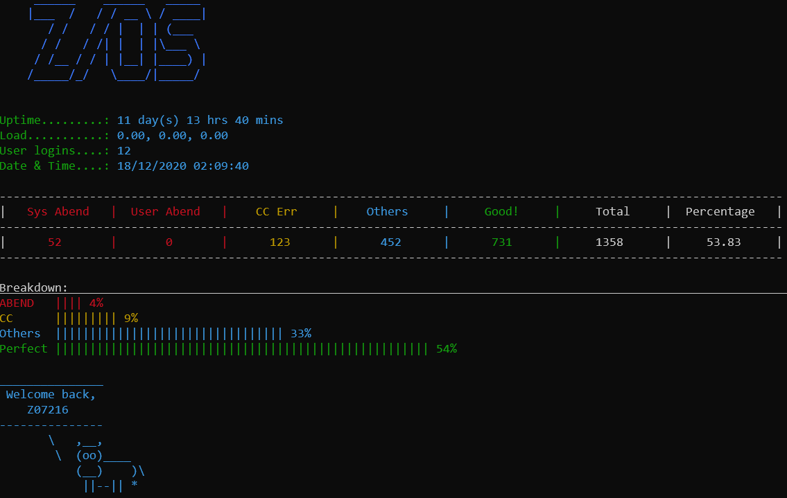
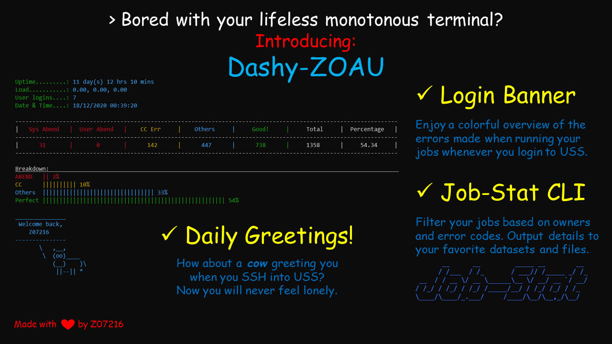

# Dashy-ZOAU


## About
Dashy-ZOAU is a project for Master the Mainframe 2020 Grand Challenge.

Since the challenge description mentions about creating a dashboard, I have decided to use IBM's [Z Open Automation Utilities 1.0.0](https://www.ibm.com/support/knowledgecenter/en/SSKFYE_1.0.1/welcome_zoautil.html) (ZOAU).

I have decided to use Python to incorporate other pip3 libraries.

## Functions
It contains 2 main elements - A banner to be displayed when users login to Unix System Services (USS) and __jobStat__ - a tool to compile and display relevant Jobs information ran in the mainframe. 

Since terminal work is usually plain and monotonous, I have decided to incorporate the use of multiple customisable colors into the tool. 
Users may customise the tool to show exactly what they want and even output the details to a file in USS or as a dataset.

Also, we do not forget the cow and its greetings whenever you login.

## Prerequisites
You will require an account to login to IBM's USS. Next, you will need this folder.

You may copy this folder from /z/z07216/Dashy-ZOAU to your local home directory.

Also, you require Python 3.7 and above.

## Setup
```
# You may clone this repo to your local home directory if git is installed.
git clone https://github.com/wonyk/Dashy-ZOAU.git

# If you do not have git and is on MtM2020, you may copy the folder from my home directory:
cp -R /z/z07216/Dashy-ZOAU ~

cd Dashy-ZOAU/
chmod +x setup.sh

# Run the setup script
./setup.sh
```
For other related matters concerning setup, you might wish to read up the comments available at the top of every file.
Those comments document the functionality of each file and some troubleshooting instructions.

## Customising
You may customise the colors and filter the jobs based on users using the configuration file `settings.py`. Follow the instructions to obtain your preferred customisations.

To use jobStat CLI, here are the various options:
```bash
# --users | -u : Filter jobs by user. Default is wildcard search. Else, provide multiple values
# --filter | -f : Filter jobs by error. Options: cc, sabend, uabend, others, good. Default to no filter. May select multiple values.
# -ds : Output Dataset name. Will create or overwrite as necessary
# --output | -o : Output file location and name. Will create the file if it does not exist and overwrite any existing files.
# --no-banner : Do not show banner

# Examples:
./jobStat.py  # Returns all jobs stats in a table and bar chart form
./jobStat.py -u Z07216 -u Z09999 -ds Z07216.OUTPUT(JOBSTAT) -o jobs.txt
# Returns all jobs by users Z07216 and Z0999 and output details to Z07216.OUTPUT(JOBSTAT) and jobs.txt in USS
```

## Acknowledgements
I would like to thank IBM for their wonderful [Master the Mainframe 2020](https://www.ibm.com/it-infrastructure/z/education/master-the-mainframe) challenge. I have truly benefitted and learnt a lot.

The crash course on USS, REXX, COBOL, Bash and Python scripting as well as LXSS, Zowe CLI and Ansible are eye-opening and truly fun to tinkle with.

Also, thanks to the various online guides which made this project possible.

## Licence
This project is licenced under the [MIT](LICENSE) license.

## Submission Poster
